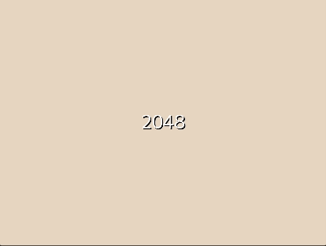

# 2048 Game in Go

A clone of the popular 2048 game implemented in Go using the Ebitengine framework. Slide and merge tiles to reach the 2048 tile!

## Demo



## Features

- Classic 2048 gameplay
- Smooth (ish) animations and transitions
- High score tracking
- Responsive (for the most part) controls using keyboard arrows
- Simple and clean UI


## Installation

1. **Clone the repository:**

   ```bash
   git clone https://github.com/andersjosef/2048.git
   ```

2. **Navigate into the project directory:**

   ```bash
   cd 2048
   ```

4. **Run the game:**

   ```bash
   go run .
   ```

## Usage

- Press any button to start.
- Use the arrow keys or WASD to move tiles.
- Combine tiles of the same number to merge them.
- Reach the 2048 tile to win the game!
- Esc to close.
